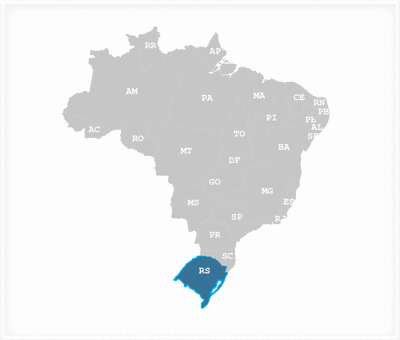

# Brazil Map (vue component)

- Some mouse events mapped.
- CircleInfo object to put some number or flag.
- Infobox to show additional data.

### Options: 

- mapa-brasil -> data -> showInfoBox: true|false (default: false)
- mapa-brasil -> data -> showCircleInfo: true|false (default: false)

